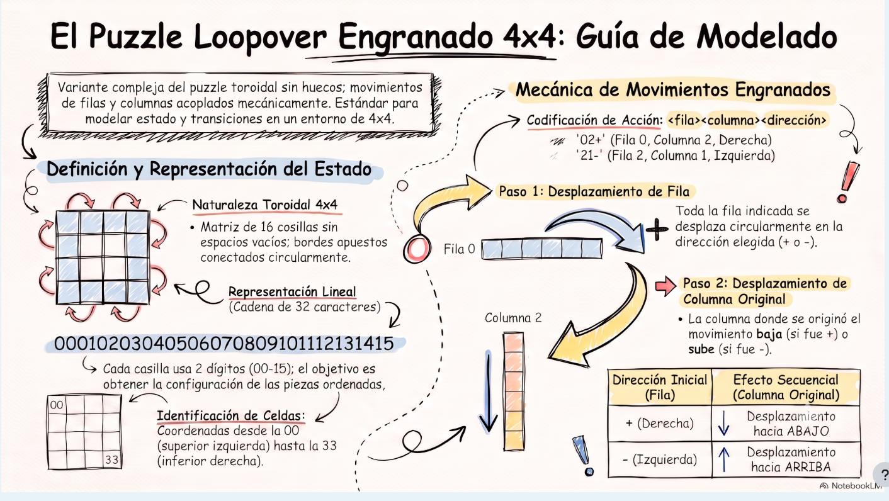

# 01 — Modelo del puzzle Loopover Engranado 4x4

| | |
|---|---|
| **Alcance** | Definición del puzzle, representación del estado y mecánica de movimiento |
| **Relacionado con** | [tarea-1-estado.md](tarea-1-estado.md) (contrato), [02-estado-y-bitboard.md](02-estado-y-bitboard.md) (implementación) |



## 1. Qué es

Variante compleja del puzzle **toroidal sin huecos**: una matriz de 16 casillas
(4x4) donde **todas las casillas están siempre ocupadas** y los bordes opuestos
están conectados circularmente (lo que sale por la derecha entra por la
izquierda, y lo que baja por el borde inferior vuelve arriba).

A diferencia del Loopover clásico (donde fila y columna se mueven por separado),
aquí los movimientos de fila y columna están **acoplados mecánicamente**: cada
acción engrana a la vez una fila y una columna. De ahí el nombre
*Loopover Engranado* y que el proyecto se describa como
*«búsqueda en espacio de estado con movimientos encadenados»*.

## 2. Representación del estado

- **Representación lineal**: cadena de **32 caracteres**; cada casilla usa
  **2 dígitos** (`00`–`15`), en orden lectura.
- **Estado resuelto** (objetivo): las piezas ordenadas,

  ```
  00010203040506070809101112131415
  ```

- **Identificación de celdas**: coordenadas de dos dígitos `<fila><columna>`,
  desde la `00` (superior izquierda) hasta la `33` (inferior derecha):

  ```
  celda:  00 01 02 03      casilla i = fila·4 + columna
          04 05 06 07      i = 0..15
          08 09 10 11
          12 13 14 15
  ```

  Los mismos dos dígitos se usan como prefijo de las acciones (§3).

## 3. Codificación de acción

Formato **`<fila><columna><dirección>`** (3 caracteres):

| Ejemplo | Significado |
|---|---|
| `02+` | Fila 0, Columna 2, dirección `+` |
| `21-` | Fila 2, Columna 1, dirección `-` |

- Fila: dígito `0`–`3`.
- Columna: dígito `0`–`3`.
- Dirección: `+` o `-`.

En código, la acción es un entero de **5 bits** (ver codificación exacta en
[02-estado-y-bitboard.md](02-estado-y-bitboard.md#3-codificación-de-acciones));
la tabla `Estado.ACCIONES` tiene las **32** acciones posibles
(4 filas × 4 columnas × 2 signos).

## 4. Mecánica del movimiento (2 pasos)

Cada acción realiza **siempre los dos pasos, en este orden**:

| Paso | Qué ocurre |
|---|---|
| **Paso 1 — Desplazamiento de fila** | Toda la **fila indicada** se desplaza circularmente en la dirección elegida: `+` → a la **derecha**, `-` → a la **izquierda**. |
| **Paso 2 — Desplazamiento de columna original** | La **columna donde se originó el movimiento** (la columna de la acción) se desplaza: `+` → hacia **abajo**, `-` → hacia **arriba**. |

| Dirección inicial (fila) | Efecto secuencial (columna original) |
|---|---|
| `+` (derecha) | ↓ desplazamiento hacia **ABAJO** |
| `-` (izquierda) | ↑ desplazamiento hacia **ARRIBA** |

Notas importantes:

- Los dos pasos son **obligatorios y encadenados**: no existe una acción que
  mueva solo una fila o solo una columna.
- La columna del paso 2 es **la de la acción**, no la columna a la que hayan
  llegado las piezas tras el paso 1.
- Al ser movimientos circulares, desplazar 4 veces en el mismo sentido devuelve
  las piezas a su sitio… pero en este puzzle **no es una propiedad de la
  acción completa**, porque cada aplicación mezcla fila y columna (ver §6).

## 5. Coste y métrica

- Cada acción tiene **coste 1** (`Sucesor` con `costo = 1.0f`): la métrica es
  *single-tile metric* (STM) de 1 celda, como en el Loopover original.
- Toda la búsqueda (Tarea 2) y las heurísticas (Tarea 3) miden en **nº de
  acciones**, no en celdas desplazadas.

## 6. Propiedades del grupo de movimientos (consecuencias prácticas)

Sean `R` el desplazamiento circular de la fila `f` y `C` el de la columna `c`
de una acción. Como `R` y `C` comparten exactamente la casilla `(f,c)`, la
composición `R·C` recorre en un solo **ciclo de 7 casillas** toda la cruz
`fila f ∪ columna c`. De ahí:

1. **Toda acción tiene orden 7**: aplicar la misma acción **7 veces seguidas**
   devuelve exactamente el estado de partida. Es una prueba de humo excelente
   para `Estado:aplicar`:

   ```bash
   java -jar target/loopover.jar verify -s <S> -a 00+,00+,00+,00+,00+,00+,00+
   # → debe imprimir <S> otra vez
   ```

2. **Paridad**: un ciclo de longitud 7 es una permutación **par**, y el
   producto de permutaciones par es par ⇒ **todo estado alcanzable es una
   permutación par**. Aproximadamente la mitad de los 16! tableros
   (los de permutación **impar**) son **insolubles**; el CLI los resolverá con
   fallo por límite de profundidad (no hay comprobación de paridad — ver
   `Decisiones abiertas` de la Tarea 1).

## 7. Mapa de lectura

| Documento | Contenido |
|---|---|
| [tarea-1-estado.md](tarea-1-estado.md) | Contrato formal de `Estado` (fuente de verdad de la Tarea 1) |
| [02-estado-y-bitboard.md](02-estado-y-bitboard.md) | Implementación: bitboard, máscaras, rotaciones y trazas |
| [referencias.md](referencias.md) | Variantes del juego y notaciones de movimientos |
